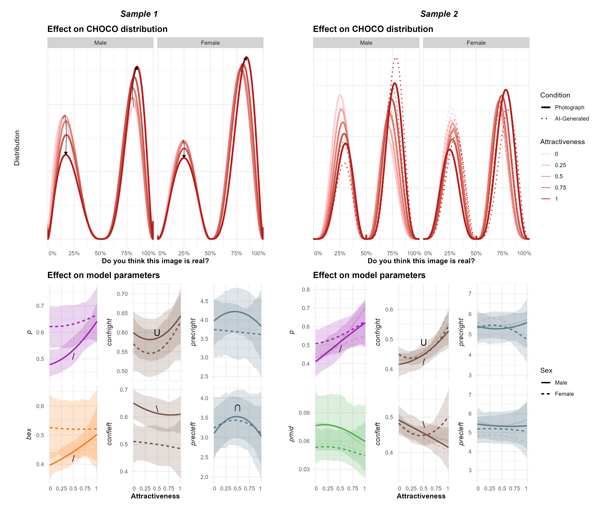

# FictionChoco

**Introducing the Choice-Confidence (CHOCO) Model for Bimodal Data from Subjective Ratings: Application to the Effect of Attractiveness on Reality Beliefs about AI-Generated Faces**

### Abstract

We introduce the Choice-Confidence (CHOCO) model as a tool to dissect the cognitive mechanisms underlying decision-making judgments, offering a better fit for data from subjective rating scales for which the two extremes correspond to discrete choices (e.g., "positive" *vs.* "negative", "true" *vs.* false", "real" *vs.* "AI-generated"), and for which the distance from the center might reflect a gradual process, such as confidence or certainty in that choice. Conceptualized as a mixture of two Beta distributions, CHOCO simultaneously estimates the probability of selecting one category (the right side of the scale over the left side) and the confidence associated with each choice. To demonstrate its usage, we apply this model to two datasets (N=141 and N=189) in which participants judged whether face images were real photographs or AI-generated images, finding that facial attractiveness increased the likelihood of being judged as "real", particularly for male participants. Given that AI-generated content is becoming increasingly indistinguishable from real stimuli, understanding how individuals form beliefs about the reality of what they perceive is both theoretically important and practically urgent. We discuss how these findings relate to the broader effect of facial attractiveness, and suggest future directions for both the cognitive and psychometric application of the CHOCO framework.

### Supplementary Materials

- [**Study 1 - Analysis**](https://realitybending.github.io/FictionChoco/analysis/study1/1_study1.html)
- [**Study 2 - Analysis**](https://realitybending.github.io/FictionChoco/analysis/study1/2_study2.html)
- [**Model definitions**](https://github.com/RealityBending/FictionChoco/blob/main/analysis/server/make_models.R)
- [**Preprint**](https://osf.io/preprints/psyarxiv/z68v3)

